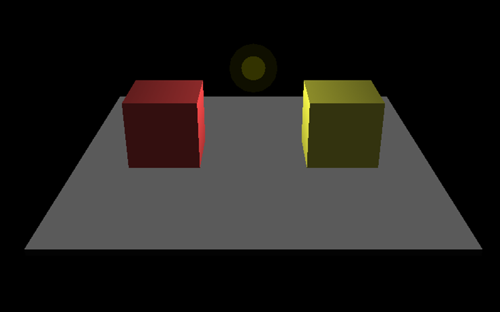
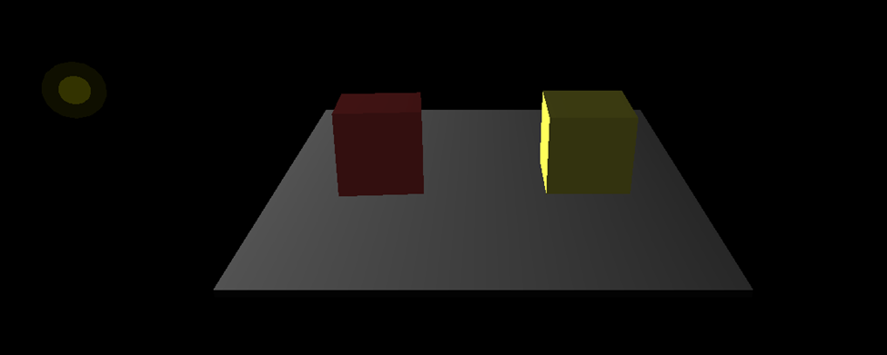
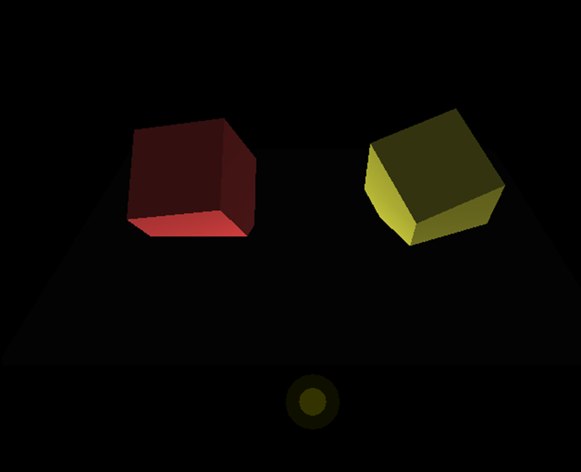

# OpenGL Z-Buffer and Shadow Demonstration



This project demonstrates core 3D rendering concepts including z-buffering, shadow projection, and lighting in OpenGL through an interactive scene with two colored cubes.

## Key Features Demonstrated

- **Z-Buffering**: Depth testing for proper object occlusion
- **Shadow Projection**: Real-time shadow calculations using projection matrices
- **Dynamic Lighting**: Movable light source with diffuse lighting
- **Interactive Controls**: Keyboard-controlled objects and light position

## Screenshots

|  |  |
|------------------------------------|------------------------------------|
| Dynamic lighting effects           | Shadow projection demonstration    |

## Technical Concepts

1. **Z-Buffer Implementation**
   - Enabled via `GL_DEPTH_TEST`
   - Depth-sorted rendering of cubes, shadows, and light source

2. **Shadow Projection**
   - Matrix-based shadow calculations
   - Ground plane projection using `glMultMatrixf`

3. **Lighting System**
   - Diffuse lighting with `GL_LIGHT0`
   - Movable light source with blended halo effect

## How to Run

### Dependencies
- OpenGL
- GLUT (OpenGL Utility Toolkit)

### Compilation
```bash
g++ zbuffer_demo.cpp -o demo -lGL -lGLU -lglut
